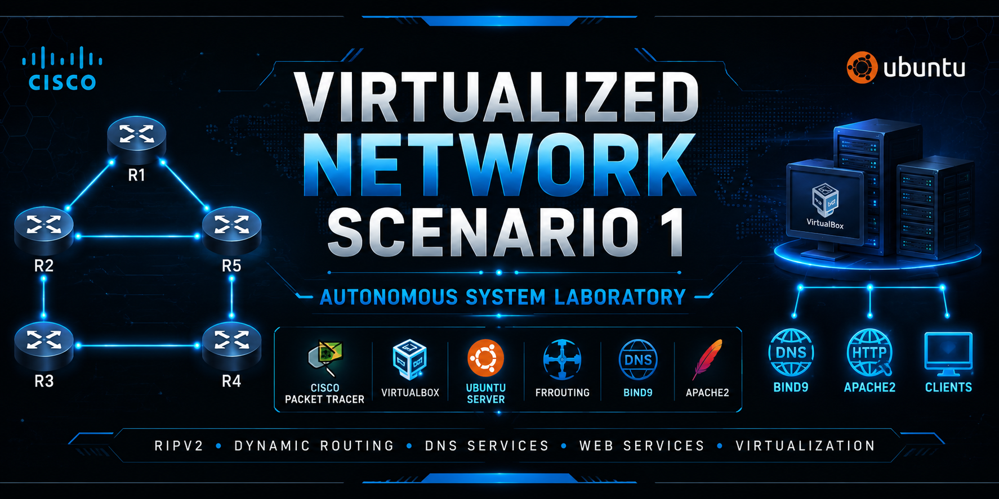

<p align="center">
  
</p>

# 🌐 Virtualized Network Scenario 1

> Enterprise network virtualization implementing an Autonomous System (AS) with RIPv2, DNS and HTTP services.


## 📖 About

This project implements a virtualized enterprise network using **Ubuntu Server**, **VirtualBox**, and **Cisco Packet Tracer**. The infrastructure includes **RIPv2 dynamic routing**, **DNS servers**, and **HTTP services**, simulating a small Autonomous System (AS).

> 📚 Developed as a university project for the **Systems Communication and Networks** course.

---

## 🖼️ Network Topology

<p align="center">
  
</p>

---

## 🛠️ Technologies

- Ubuntu Server
- VirtualBox
- Cisco Packet Tracer
- FRRouting (RIPv2)
- BIND9
- Apache2
- Netplan

---

## 📂 Project Structure

```text
.
├── configs/
├── docs/
├── images/
├── packet-tracer/
├── virtualbox/
├── certificates/
└── README.md
```

---

## 📄 Documentation

Additional documentation is available in the **docs/** directory, including:

- Implementation Guide
- ABNT Report
- Network Configuration
- Validation Tests

---

## 👨‍💻 Author

**Gustavo Barreto**

Software Engineering Student • Cybersecurity & Networking
