# Implementação no VirtualBox

Esta pasta reúne evidências da implementação do **Cenário 01** utilizando máquinas virtuais Ubuntu Server no Oracle VirtualBox.

Foram utilizados:

- redes internas do VirtualBox;
- FRRouting com RIPv2;
- BIND9 para resolução DNS;
- Apache2 para hospedagem das páginas;
- clientes Ubuntu Server para validação dos serviços.

---

## Testes dos clientes

### PC-A — ping para o WEB1

O PC-A conseguiu alcançar o WEB1, localizado no endereço `192.168.1.10`.

  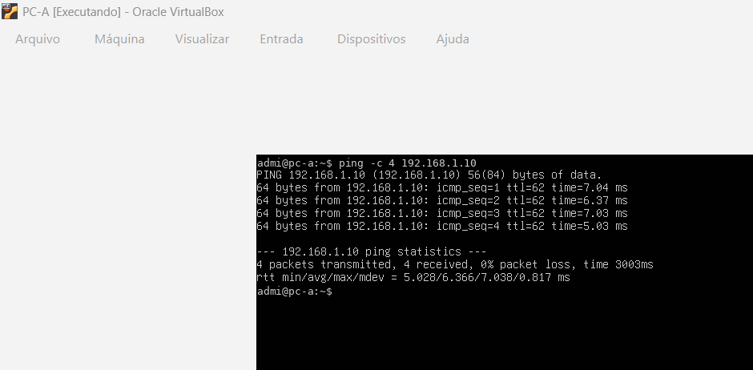

### PC-A — acesso HTTP ao WEB1

O comando `curl` confirmou o acesso à página hospedada pelo Apache2 no WEB1.

  

### PC-C — ping para o WEB3

O PC-C conseguiu alcançar o WEB3, localizado no endereço `192.168.3.10`.

  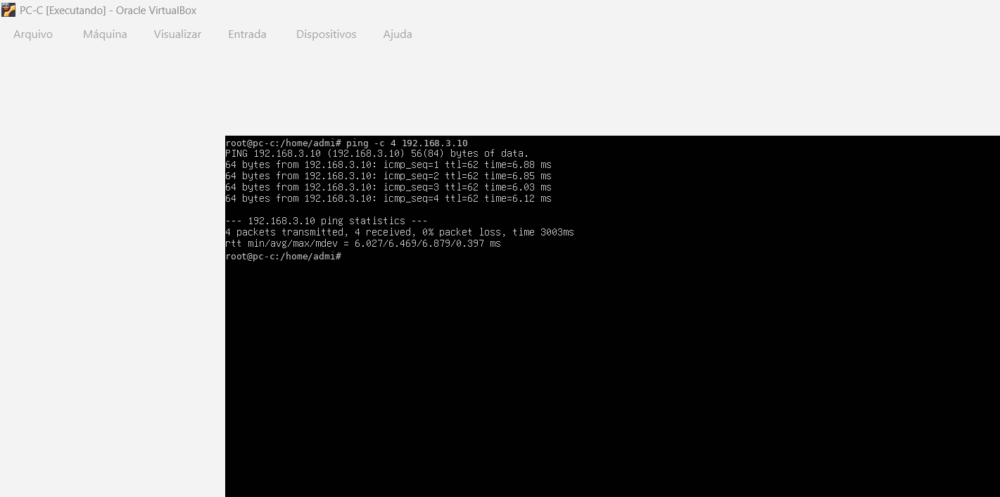

### PC-C — acesso HTTP ao WEB3

O comando `curl` confirmou o acesso à página hospedada pelo Apache2 no WEB3.

  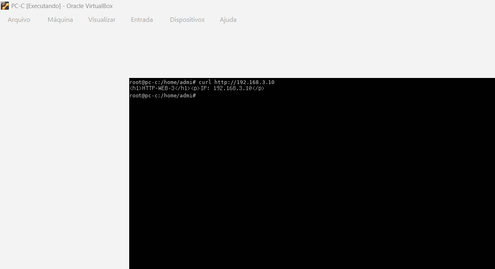

---

## Testes de roteamento

### Tabela de rotas do R1

A tabela mostra as redes diretamente conectadas e as rotas aprendidas dinamicamente pelo protocolo RIPv2.

  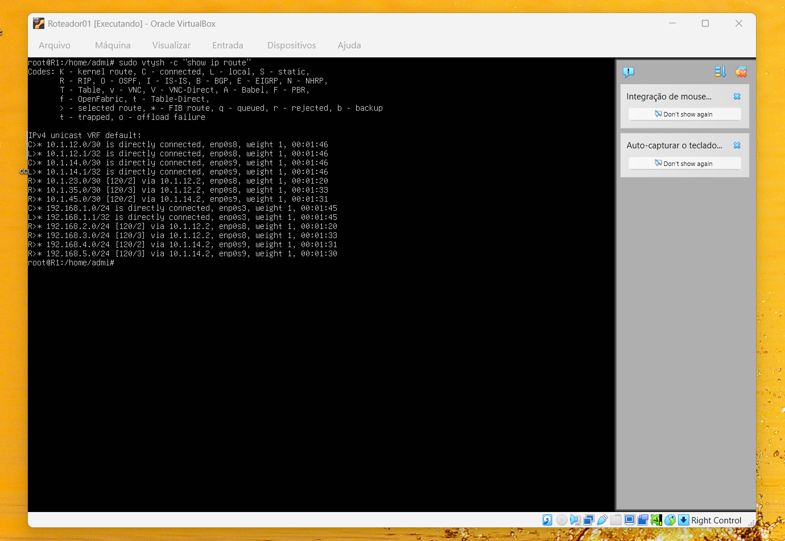

### Rotas RIPv2 do R1

O teste mostra as redes conhecidas pelo R1 e os próximos saltos utilizados para alcançar as redes remotas.

  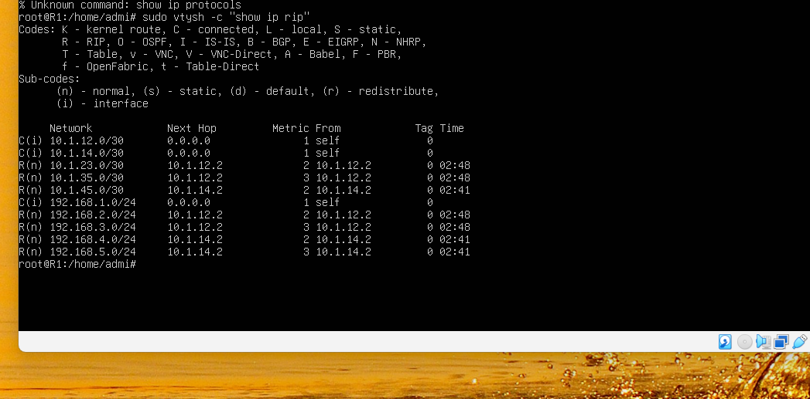

### Tabela de rotas do R5

O R5 também aprendeu as redes remotas pelo protocolo RIPv2.

  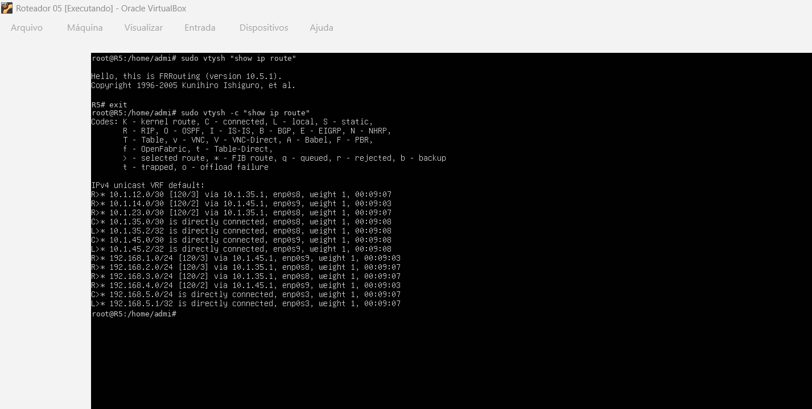

---

## Testes dos servidores DNS

### Resolução pelo DNS1

O DNS1, localizado no endereço `192.168.1.5`, resolveu corretamente:

- `servidor1.rede.local` para `192.168.1.10`;
- `servidor2.rede.local` para `192.168.2.10`.

  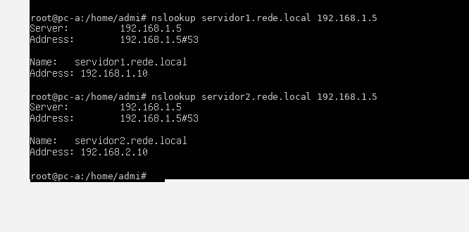

### Resolução pelo DNS2

O DNS2, localizado no endereço `192.168.4.5`, resolveu corretamente:

- `servidor3.rede.local` para `192.168.3.10`.

  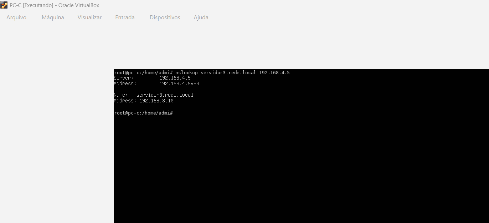

---

## Testes dos servidores Apache2

### WEB1

O serviço Apache2 está ativo no WEB1, no endereço `192.168.1.10`.

  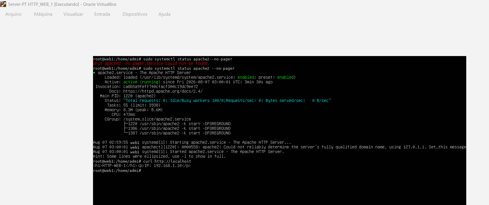

### WEB2

O serviço Apache2 está ativo no WEB2, no endereço `192.168.2.10`.

  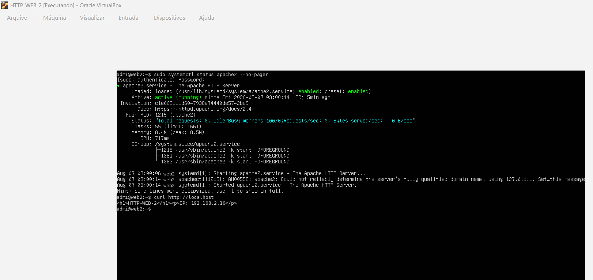

### WEB3

O serviço Apache2 está ativo no WEB3, no endereço `192.168.3.10`.

  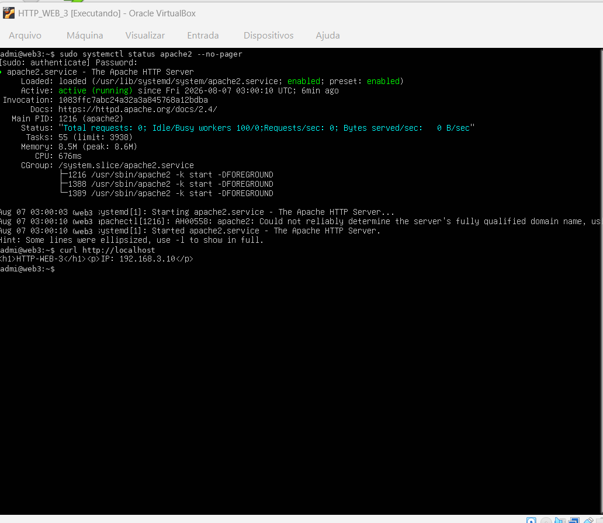

---

## Configurações utilizadas

As configurações das máquinas estão disponíveis nas seguintes pastas:

- [Configurações dos clientes](../configs/clients/)
- [Configurações dos roteadores](../configs/routers/)
- [Configurações dos servidores DNS](../configs/dns/)
- [Configurações dos servidores web](../configs/web/)

---

## Resultado

Os testes comprovaram:

- funcionamento do roteamento dinâmico RIPv2;
- aprendizagem de rotas entre os cinco roteadores;
- comunicação entre redes diferentes;
- resolução dos nomes da zona `rede.local`;
- funcionamento dos servidores BIND9;
- funcionamento dos três servidores Apache2;
- acesso HTTP entre clientes e servidores de redes distintas.
